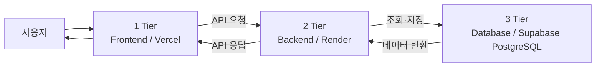
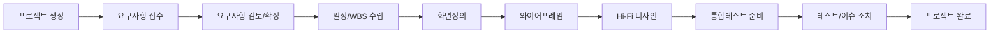
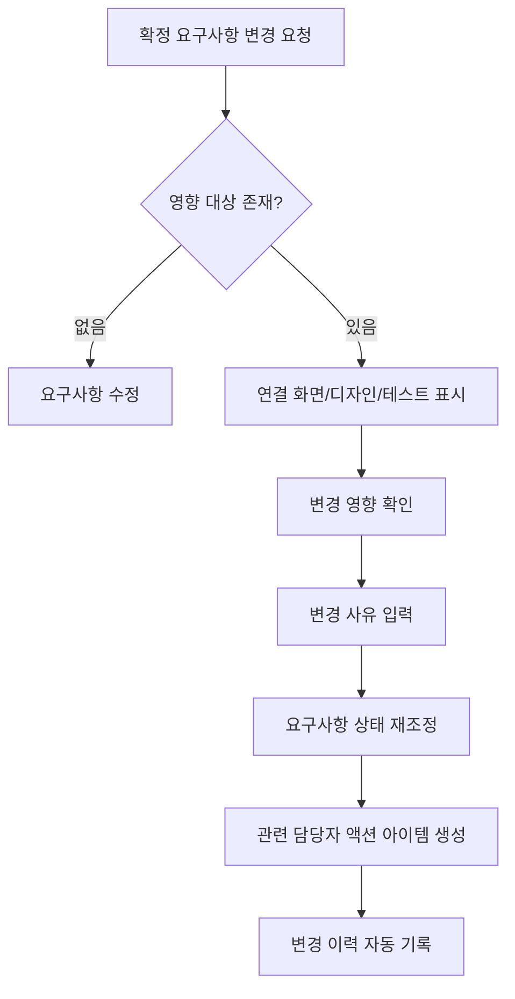
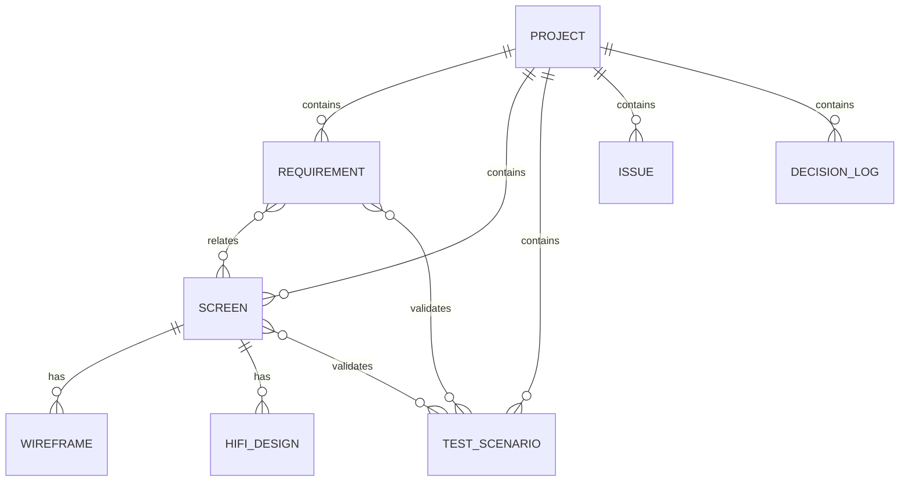

# 프로젝트 기획·디자인 산출물 통합 관리 플랫폼 PRD

> **문서 버전**: v1.2  
> **문서 목적**: 프로젝트 기획·디자인 산출물 관리 플랫폼의 UX 구조, IA, 핵심 플로우, 화면 설계 원칙 및 컴포넌트를 정의한다.  
> **주요 사용자**: 기획자, UI/UX 파트, 개발자, 사업부 실무자, 관리자  
> **제품 유형**: B2B SaaS / 기획 중심 프로젝트 관리 플랫폼

---

## 0. 3-Tier 시스템 아키텍처 정의

본 PRD에서 **3-Tier는 서비스의 정보 구조가 아니라 시스템 아키텍처 계층**을 의미한다. 각 Tier는 UI 표현, 비즈니스 로직, 데이터 저장 역할을 분리하여 독립적인 개발·배포·확장이 가능하도록 구성한다.

| Tier | 계층 | 역할 | 주요 책임 | 적용 환경 |
|---|---|---|---|---|
| **1 Tier** | **Frontend** | 사용자 인터페이스 및 클라이언트 경험 제공 | 화면 렌더링, 사용자 입력, 상태 표시, 검색/필터 UI, API 호출, 권한별 UI 제어 | **Vercel** |
| **2 Tier** | **Backend** | 비즈니스 로직 및 API 처리 | 인증/인가, 프로젝트·요구사항·화면·테스트 CRUD, 상태 전이, 관계 처리, 변경 이력, 검토/확정 로직 | **Render** |
| **3 Tier** | **Database** | 서비스 데이터 저장 및 관계 관리 | 프로젝트, 요구사항, 화면, 디자인, 테스트, 이슈, 사용자/권한, 변경 이력, 의사결정 로그 저장 | **Supabase (PostgreSQL)** |

### 0.1 Tier별 책임 경계

#### 1 Tier — Frontend
- 사용자가 프로젝트 현황과 산출물 상태를 빠르게 이해할 수 있는 UI를 제공한다.
- API에서 받은 데이터를 표, 카드, 상태 배지, 타임라인, 레일 보드 형태로 표현한다.
- 폼 입력값의 기본 검증 및 사용자 인터랙션을 처리한다.
- 실제 권한 검증은 Backend에서 수행하되, 권한에 따라 사용할 수 없는 액션은 UI에서도 비활성화하거나 숨긴다.
- 프로젝트/요구사항/화면/테스트 간 이동 시 현재 프로젝트 컨텍스트를 유지한다.

#### 2 Tier — Backend
- Frontend에 필요한 REST API 또는 이에 준하는 API 계층을 제공한다.
- 사용자 인증 및 역할 기반 권한을 검증한다.
- 프로젝트, 요구사항, 화면, 와이어프레임, Hi-Fi 디자인, 테스트, 이슈 등의 생성·조회·수정·삭제 로직을 처리한다.
- 요구사항 ↔ 화면의 N:M 관계와 화면 ↔ 테스트 시나리오 등의 연결 관계를 관리한다.
- 확정, 확정 해제, 일정 변경, 삭제 등 위험 액션의 비즈니스 규칙을 검증한다.
- 상태 변경, 버전 변경, 의사결정 등의 변경 이력을 기록한다.

#### 3 Tier — Database / Supabase
- **Supabase의 PostgreSQL Database**를 서비스의 영속 데이터 저장소로 사용한다.
- Supabase는 본 아키텍처에서 **3 Tier(Database 계층)**로 정의하며, 핵심 비즈니스 로직과 API는 2 Tier인 Render Backend에서 처리하는 것을 기본 원칙으로 한다.
- 프로젝트를 기준으로 요구사항, 화면, 테스트, 이슈, 산출물, 의사결정 로그를 관계형으로 관리한다.
- 요구사항 ↔ 화면 N:M 관계를 위한 매핑 테이블을 구성한다.
- 최신본 추적을 위해 산출물 버전 및 변경 이력 데이터를 보존한다.
- 조회 성능을 위해 프로젝트 ID, 상태, 담당자, 화면 ID, 요구사항 ID 등 주요 검색 조건에 인덱스를 고려한다.

### 0.2 기본 데이터 흐름



> **3 Tier Database는 Supabase(PostgreSQL)로 확정한다.** Frontend에서 Database로 직접 접근하는 구조는 기본적으로 사용하지 않으며, 데이터 조회·저장과 권한 검증은 `Vercel Frontend → Render Backend → Supabase Database` 흐름을 원칙으로 한다.

### 0.3 제품 개발 우선순위

3-Tier와 혼동되지 않도록 제품 기능 우선순위는 `Tier`가 아닌 **Release Phase**로 구분한다.

| 우선순위 | 정의 | 포함 범위 |
|---|---|---|
| **Phase 1 / Core** | 플랫폼의 핵심 사용 가치를 만드는 기능 | 홈 대시보드, 프로젝트, 요구사항, 화면정의, 산출물 상태, 테스트/이슈, 기본 권한 |
| **Phase 2 / Collaboration** | 협업 효율과 추적성을 높이는 기능 | 검토 요청, 댓글/의견, 변경 이력, 의사결정 로그, 버전 관리, 액션 아이템 |
| **Phase 3 / Governance & Insight** | 조직 단위 운영과 분석을 강화하는 기능 | 공통 코드, 관리자 설정, 감사 로그, 고급 필터, 리포트, 자동 위험 감지, 외부 도구 연동 |

---

# 1. 서비스 UX 컨셉 요약

## 1.1 UX 컨셉

### **“프로젝트의 현재 위치와 산출물의 연결 상태를 한눈에 보여주는 기획 허브”**

이 서비스는 개발 태스크를 세분화하여 관리하는 Jira형 도구가 아니라, 프로젝트 앞단에서 기획자가 반복적으로 확인하는 **요구사항, 일정, 화면, 디자인, 테스트 준비 상태와 의사결정 근거**를 하나의 흐름으로 연결하는 것을 목표로 한다.

핵심 사용 경험은 다음 세 가지다.

1. **See — 지금 상태를 본다.**
   - 여러 프로젝트의 진행 위치와 위험 신호를 홈에서 빠르게 확인한다.
   - 숫자보다 “어디에서 멈췄는가”를 우선 보여준다.

2. **Trace — 연결 관계를 추적한다.**
   - 요구사항 → 화면 → 와이어프레임 → Hi-Fi 디자인 → 테스트가 서로 연결된다.
   - 어느 산출물에서 변경이 발생했는지 역추적할 수 있다.

3. **Decide — 검토하고 결정한다.**
   - 검토 대기, 수정 필요, 확정, 보류 상태를 명확히 구분한다.
   - 확정/변경 시 의사결정 근거와 변경 이력을 남긴다.

## 1.2 UX 설계 원칙

### 원칙 A. 한눈에 파악
- 프로젝트별 진행 단계를 동일한 기준으로 시각화한다.
- 홈은 상세 데이터보다 우선순위 판단에 필요한 정보만 노출한다.
- 사용자가 5초 내에 `지연 프로젝트`, `검토 대기`, `내 할 일`을 찾을 수 있어야 한다.

### 원칙 B. 연결성 중심
- 산출물을 파일처럼 독립 관리하지 않고 관계형 데이터로 연결한다.
- 모든 상세 화면에서 관련 요구사항, 관련 화면, 관련 테스트로 이동 가능해야 한다.
- N:M 관계는 링크 칩, 관계 패널, 연결 개수 등으로 명확히 표현한다.

### 원칙 C. 기획자 중심
- 개발 스프린트, 코드, 배포 태스크보다 기획 산출물의 준비 상태를 우선한다.
- “완료 여부”보다 “검토·확정 여부”를 중요 상태로 취급한다.

### 원칙 D. 상태 기반 관리
- 사용자가 문서를 일일이 열지 않아도 상태 배지로 흐름을 파악할 수 있어야 한다.
- 상태 변경에는 변경자, 변경일, 사유를 자동 기록한다.

### 원칙 E. 최소 입력, 최대 추적
- 생성 시 필수 입력값을 최소화한다.
- 생성 후 관계 연결 및 세부 내용은 점진적으로 입력한다.
- 작성자, 수정일, 상태 변경 이력, 버전 정보는 시스템이 자동 기록한다.

## 1.3 UI 스타일 방향

- 토스 계열의 **간결한 정보 위계와 충분한 여백**을 참고하되 서비스 고유 UI로 설계한다.
- 기본 배경은 중립색 중심, 강조색 사용은 액션과 상태 표현에 제한한다.
- 한 화면에서 과도한 색을 사용하지 않는다.
- 표는 데이터 비교용, 카드는 요약용, 레일/타임라인은 흐름 확인용으로 역할을 명확히 구분한다.
- 상태는 색상만으로 구분하지 않고 **텍스트 + 아이콘/배지 형태**를 함께 사용한다.

---

# 2. 최종 IA

## 2.1 Global Navigation

```text
홈
├─ 전체 현황
├─ 프로젝트 진행 위치
├─ 내 액션 아이템
└─ 위험 알림

프로젝트
├─ 프로젝트 목록
└─ [프로젝트 워크스페이스]
   ├─ 프로젝트 개요
   ├─ 일정관리
   ├─ 산출물
   └─ 의사결정 로그

요구사항
├─ 요구사항 목록
├─ 요구사항 등록/수정
├─ 요구사항 상세
├─ 변경 이력
└─ 검토 의견

화면기획
├─ 화면 목록
├─ 화면정의
├─ 와이어프레임
├─ Hi-Fi 디자인
└─ 디자인 검토

테스트/이슈
├─ 테스트 시나리오
├─ 테스트 결과
├─ 결함 관리
├─ 이슈 관리
└─ 조치 현황
```

## 2.2 IA 계층 구조

### Level 1 — Portfolio
- 홈
- 전체 프로젝트 목록
- 내 액션 아이템
- 위험 알림

### Level 2 — Project Workspace
- 프로젝트 개요
- 일정관리
- 프로젝트별 요구사항
- 프로젝트별 화면 목록
- 프로젝트별 산출물
- 프로젝트별 테스트/이슈
- 의사결정 로그

### Level 3 — Artifact Detail
- 요구사항 상세
- 화면정의 상세
- 와이어프레임 상세/버전
- Hi-Fi 디자인 상세/버전
- 테스트 시나리오 상세
- 이슈 상세
- 검토 의견
- 변경 이력

## 2.3 공통 컨텍스트 구조

모든 Level 2~3 화면 상단에는 다음 컨텍스트를 유지한다.

`프로젝트명 > 업무 영역 > 상세 항목`

예시:

`통합인증 리뉴얼 > 화면기획 > SCR-024 인증서 신청`

이를 통해 사용자가 깊은 상세 화면에 들어가도 현재 프로젝트와 업무 위치를 잃지 않도록 한다.

---

# 3. 핵심 사용자 플로우

## 3.1 전체 프로젝트 운영 플로우



## 3.2 기획자 핵심 플로우

```text
홈 진입
→ 위험 프로젝트 및 내 액션 확인
→ 프로젝트 선택
→ 프로젝트 개요에서 단계/일정/산출물 상태 확인
→ 요구사항 검토 및 확정
→ 관련 화면 연결 또는 신규 화면 생성
→ 화면정의 작성
→ 와이어프레임 검토 요청
→ 디자인 검토 및 확정
→ 테스트 시나리오 연결
→ 이슈 확인 및 조치 상태 추적
→ 프로젝트 완료 조건 확인
```

## 3.3 UI/UX 파트 핵심 플로우

```text
내 액션 아이템
→ 검토/작업 요청 화면 확인
→ 화면정의 및 관련 요구사항 열람
→ 와이어프레임 링크/버전 등록
→ 검토 요청
→ 피드백 확인
→ 수정 버전 등록
→ 와이어프레임 확정
→ Hi-Fi 디자인 등록
→ 디자인 검토/수정
→ 디자인 확정
```

## 3.4 개발자 핵심 플로우

```text
프로젝트 진입
→ 확정 요구사항 필터
→ 화면정의 확인
→ 관련 Hi-Fi 디자인 링크 확인
→ 정책/예외/권한 조건 확인
→ 기술 검토 의견 등록
→ 변경된 요구사항 알림 확인
```

## 3.5 사업부 실무자 핵심 플로우

```text
요구사항 등록
→ 기획자 검토 상태 확인
→ 화면/디자인 검토 요청 수신
→ 검토 의견 등록
→ 의사결정 내용 확인
→ 테스트 참여
→ 테스트 결과 또는 이슈 등록
```

## 3.6 변경 발생 플로우



## 3.7 검토·확정 플로우

```text
작성중
→ 검토요청
→ 검토 의견 등록
→ 수정중
→ 재검토 요청
→ 확정

※ 확정 해제 시 사유 입력 필수
※ 확정 이후 신규 버전 등록 시 기존 확정본은 보존
```

---

# 4. 화면별 목적과 주요 컴포넌트

| 우선순위 | 화면 | 목적 | 주요 컴포넌트 |
|---:|---|---|---|
| 1 | 홈 | 전체 프로젝트 상태와 개인 액션 파악 | 요약 카드, 프로젝트 레일, 위험 목록, 액션 리스트, 변경 피드 |
| 2 | 프로젝트 목록 | 프로젝트 탐색 및 상태 비교 | 검색, 필터, 테이블/카드 토글, 상태 배지, 진행률 |
| 3 | 프로젝트 개요 | 특정 프로젝트의 단일 진입점 | 단계 레일, KPI 카드, 일정, 산출물 상태, 참여자, 최근 변경 |
| 4 | 요구사항 목록 | 요구사항의 상태·우선순위·연결 관계 관리 | 데이터 테이블, 필터, 관계 칩, 일괄 액션 |
| 5 | 요구사항 상세 | 요구사항 검토·확정·변경 추적 | 상세 정보, 상태 변경, 연결 화면, 댓글, 변경 이력 |
| 6 | 화면 목록 | 프로젝트 화면 단위 진행 상황 파악 | 화면 테이블, 메뉴 경로, 상태, 연결 요구사항, 디자인 상태 |
| 7 | 화면정의 | 화면 정책·기능·입출력·예외 정의 | 정의 폼, 관계 패널, 와이어프레임/디자인 링크, 변경 이력 |
| 8 | 와이어프레임 관리 | 와이어프레임 버전 및 검토 상태 관리 | 링크/파일 카드, 버전, 검토 요청, 댓글, 확정 액션 |
| 9 | Hi-Fi 디자인 관리 | 최종 디자인 링크와 검토 상태 관리 | 디자인 링크, 버전, 상태 배지, 검토 의견, 확정 액션 |
| 10 | 산출물 | 프로젝트 전체 산출물 최신본 확인 | 산출물 테이블, 유형, 버전, 최신 여부, 담당자, 링크 |
| 11 | 의사결정 로그 | 주요 결정 근거 추적 | 결정 카드/테이블, 결정일, 결정자, 관련 항목, 첨부/링크 |
| 12 | 테스트/이슈 목록 | 테스트 준비와 미해결 이슈 관리 | 테스트 진행률, 이슈 테이블, 심각도, 담당자, 조치 상태 |

---

# 5. 홈 화면 상세 설계

## 5.1 화면 목적

사용자가 로그인 후 **30초 이내에 전체 프로젝트의 상태, 위험 프로젝트, 본인 액션을 파악**하고 다음 업무로 이동할 수 있도록 한다.

## 5.2 정보 우선순위

1. 내 액션이 필요한가?
2. 지연 또는 위험한 프로젝트가 있는가?
3. 각 프로젝트는 어느 단계에 있는가?
4. 최근 무엇이 바뀌었는가?

## 5.3 권장 레이아웃

```text
┌──────────────────────────────────────────────────────────────┐
│ 홈                                      [프로젝트 생성]      │
│ 담당 프로젝트의 진행 상황과 필요한 액션을 확인하세요.       │
├──────────────────────────────────────────────────────────────┤
│ [진행중 8] [지연 2] [검토대기 11] [미해결 이슈 7]            │
├──────────────────────────────────────────────────────────────┤
│ 프로젝트 진행 위치                                           │
│ ------------------------------------------------------------ │
│ 프로젝트 A  ●──●──●──◉──○──○──○  화면정의  52%  D-34       │
│ 프로젝트 B  ●──●──●──●──●──◉──○  통합테스트 82% [지연]     │
│ 프로젝트 C  ●──●──◉──○──○──○──○  일정수립  24%             │
├───────────────────────────────────┬──────────────────────────┤
│ 위험 프로젝트                    │ 내 액션 아이템            │
│ · 프로젝트 B / 일정 5일 지연     │ · 요구사항 3건 검토       │
│ · 프로젝트 D / 디자인 검토 4일   │ · 디자인 2건 확인         │
│ · 프로젝트 F / 이슈 6건 미해결   │ · 의사결정 1건 확인       │
├───────────────────────────────────┴──────────────────────────┤
│ 최근 변경사항                                                │
│ 14:32 SCR-024 Hi-Fi 디자인 v3 등록 · 김OO                    │
│ 13:10 REQ-103 요구사항 확정 · 이OO                           │
└──────────────────────────────────────────────────────────────┘
```

## 5.4 전체 요약 카드

### 표시 항목
- 진행 중 프로젝트 수
- 지연 프로젝트 수
- 검토 대기 건수
- 미해결 이슈 수

### 인터랙션
- 카드 클릭 시 해당 조건이 적용된 목록으로 이동한다.
- 숫자는 단순 집계값이며 증감 정보는 필수가 아니다.
- 지연/위험 수치만 시각적으로 강조한다.

## 5.5 프로젝트 진행 위치 보드

### 프로젝트 단계

`요구사항 → 일정수립 → 화면정의 → 와이어프레임 → Hi-Fi 디자인 → 통합테스트 → 완료`

### 프로젝트 행 표시 정보
- 프로젝트명
- 현재 단계
- 전체 진행률
- 지연 여부
- 검토 대기 건수
- 미해결 이슈 수
- 예정 종료일
- 프로젝트 책임 기획자

### 레일 상태 표현
- 완료 단계: 채워진 노드
- 현재 단계: 강조 노드
- 예정 단계: 비활성 노드
- 지연 단계: 경고 아이콘 추가
- 단계별 숫자 표기보다 hover/클릭 시 상세 팝오버 제공

### 정렬 기준
기본 정렬은 다음 우선순위를 권장한다.

1. 지연 프로젝트
2. 위험 프로젝트
3. 검토 대기가 오래된 프로젝트
4. 종료 예정일이 가까운 프로젝트
5. 일반 진행 프로젝트

## 5.6 위험 프로젝트 목록

### 위험 조건
- 일정 기준일 초과
- 검토 요청 후 N일 이상 미처리
- 미해결 High 이슈 존재
- 프로젝트 종료 예정일 임박 + 필수 산출물 미확정

### 표시 정보
- 프로젝트명
- 위험 사유
- 경과일 또는 D-Day
- 담당자
- 바로가기

## 5.7 내 액션 아이템

### 액션 유형
- 요구사항 검토
- 화면정의 검토
- 와이어프레임 검토
- 디자인 검토
- 의사결정 확인
- 테스트 결과 확인
- 이슈 조치/확인

### 표시 원칙
- “무엇을 해야 하는지”를 제목에 명시한다.
- 프로젝트명은 보조 정보로 제공한다.
- 마감일이 있으면 D-Day를 표시한다.
- 완료 액션은 즉시 리스트에서 제거하거나 완료 영역으로 이동한다.

## 5.8 최근 변경사항

### 이벤트 예시
- 요구사항 생성/수정/확정/확정해제
- 화면정의 변경
- 와이어프레임 버전 등록
- Hi-Fi 디자인 버전 등록
- 테스트 결과 등록
- 이슈 상태 변경
- 의사결정 로그 등록

### 표시 정보
`시간 + 대상 + 변경 내용 + 변경자`

## 5.9 홈 상태 정의

- 데이터 없음: “아직 참여 중인 프로젝트가 없어요.” + 권한에 따라 `프로젝트 생성` 또는 안내만 제공
- 일부 위젯만 없음: 위젯 자체를 숨기지 않고 Empty 상태 노출
- 로딩: 카드/레일/리스트 Skeleton
- 오류: 위젯 단위 재시도 가능

---

# 6. 요구사항 화면 상세 설계

## 6.1 요구사항 목록

### 화면 목적
프로젝트별 요구사항을 우선순위, 상태, 화면 연결 여부, 담당자 기준으로 관리한다.

### 상단 컨트롤
- 프로젝트 선택
- 검색
- 상태 필터
- 담당자 필터
- 우선순위 필터
- 연결 화면 유무
- 변경 여부
- `요구사항 등록` 버튼

### 테이블 컬럼

| 컬럼 | 설명 |
|---|---|
| 요구사항 ID | REQ-001 형태, 자동 생성 권장 |
| 요구사항명 | 핵심 요구사항 제목 |
| 구분 | 신규/개선/정책/오류 등 |
| 우선순위 | High/Medium/Low 또는 조직 코드 |
| 상태 | 요구사항 상태값 |
| 관련 화면 | 연결 화면 수 또는 화면 ID |
| 담당자 | 주 담당 기획자 |
| 요청자 | 사업부 등 최초 요청자 |
| 최근 수정일 | 마지막 변경 시점 |
| 검토 대기 | 검토 요청 존재 여부 |

### 빠른 액션
- 상세 보기
- 상태 변경
- 화면 연결
- 담당자 변경
- 검토 요청

## 6.2 요구사항 등록/수정

### 최소 생성 필드
- 요구사항명
- 요청 내용
- 프로젝트
- 요청자

### 상세 입력 필드
- 요구사항 ID
- 구분
- 배경/목적
- 상세 내용
- 우선순위
- 관련 화면
- 담당자
- 요청일
- 목표 반영일
- 첨부/참고 링크
- 상태

### UX 원칙
- 신규 생성 시 모든 필드를 강제하지 않는다.
- 저장 후 상세 화면에서 관련 화면, 담당자, 우선순위 등을 보완할 수 있다.
- 입력 중 이탈 시 작성 내용 보존 또는 이탈 확인을 제공한다.

## 6.3 요구사항 상세

### 상단 Summary
- 요구사항 ID / 요구사항명
- 상태 배지
- 우선순위
- 담당자
- 최종 수정일
- `검토 요청`, `확정`, `수정`, `더보기` 액션

### 본문 탭
1. 상세 내용
2. 관련 화면
3. 검토 의견
4. 변경 이력

### 관련 화면 영역
- 화면 ID
- 화면명
- 화면 상태
- 와이어프레임 상태
- 디자인 상태
- 연결 해제 액션
- `화면 연결` 액션

### 변경 영향 알림
확정된 요구사항을 수정할 경우 관련 화면/디자인/테스트가 있으면 다음 형태의 경고를 제공한다.

> 이 요구사항은 3개 화면과 2개 테스트 시나리오에 연결되어 있습니다. 변경 시 관련 산출물 재검토가 필요할 수 있습니다.

## 6.4 요구사항 상태 전이

```text
접수 → 검토중 → 확정 → 화면정의중 → 디자인중 → 테스트중 → 완료
             ↘ 보류
```

### 상태 변경 제약
- `확정` 시 담당 기획자 또는 승인 권한 필요
- `확정 해제` 시 변경 사유 필수
- `완료` 시 미해결 필수 검토 항목 존재 여부 확인

## 6.5 검토 의견

### 의견 유형
- 일반 의견
- 수정 요청
- 확인 요청
- 의사결정 필요

### 기능
- @멘션
- 해결/미해결 상태
- 관련 항목 링크
- 작성/수정 시간
- 해결자 기록

---

# 7. 화면기획 화면 상세 설계

## 7.1 화면 목록

### 화면 목적
프로젝트 내 모든 화면의 기획·와이어프레임·디자인 진행 상태를 한 번에 비교한다.

### 주요 필터
- 프로젝트
- 화면 상태
- 메뉴 경로
- 담당자
- 관련 요구사항
- 와이어프레임 상태
- Hi-Fi 디자인 상태
- 검토 대기 여부

### 권장 컬럼

| 컬럼 | 설명 |
|---|---|
| 화면 ID | SCR-001 |
| 화면명 | 화면명 |
| 메뉴 경로 | 1Depth > 2Depth > 3Depth |
| 화면 상태 | 기획중/검토중/와이어프레임중/디자인중/확정/보류 |
| 관련 요구사항 | 연결 수 + 대표 ID |
| 와이어프레임 | 상태 + 최신 버전 |
| Hi-Fi | 상태 + 최신 버전 |
| 검토 대기 | 건수 |
| 담당자 | 화면 담당 기획자 |
| 최근 수정일 | 최근 변경일 |

## 7.2 화면정의 상세

### 화면 헤더
- 화면 ID
- 화면명
- 화면 상태
- 담당자
- 최근 변경일
- 확정 여부
- `검토 요청`, `확정`, `수정` 액션

### 필수 입력 항목

1. 화면 ID
2. 화면명
3. 메뉴 경로
4. 화면 목적
5. 관련 요구사항
6. 주요 기능
7. 입력 항목
8. 출력 항목
9. 버튼/액션
10. 예외 메시지
11. 권한 조건
12. 와이어프레임 링크
13. Hi-Fi 디자인 링크
14. 화면 상태
15. 검토 의견
16. 변경 이력

## 7.3 권장 화면정의 구조

```text
[기본 정보]
- 화면 ID
- 화면명
- 메뉴 경로
- 화면 목적
- 화면 상태

[관련 요구사항]
- REQ-012 로그인 정책 개선
- REQ-018 휴대폰 인증 추가

[화면 기능]
- 주요 기능
- 버튼/액션
- 권한 조건

[입출력 정의]
- 입력 항목 테이블
- 출력 항목 테이블

[메시지/예외]
- 조건
- 메시지
- 처리 방식

[디자인 산출물]
- Wireframe v3 / 확정
- Hi-Fi v2 / 검토요청

[협업]
- 검토 의견
- 변경 이력
```

## 7.4 입력 항목 테이블

| 항목 | 필수 | 형식/조건 | 기본값 | 오류 메시지 | 비고 |
|---|---|---|---|---|---|
| 사용자명 | Y | 최대 50자 | 없음 | 이름을 입력해 주세요. | 예시 |

## 7.5 버튼/액션 정의 테이블

| 버튼/액션 | 노출 조건 | 동작 | 성공 후 | 실패 시 |
|---|---|---|---|---|
| 저장 | 편집 권한 | 입력값 저장 | 저장 완료 토스트 | 오류 안내 |

## 7.6 예외 메시지 정의 테이블

| 발생 조건 | 메시지 | 사용자 액션 | 비고 |
|---|---|---|---|
| 필수값 누락 | 필수 정보를 입력해 주세요. | 해당 필드 입력 | 공통 |

## 7.7 관련 요구사항 N:M 연결 UX

- 화면 상세에서 여러 요구사항을 연결할 수 있다.
- 요구사항 상세에서도 여러 화면을 연결할 수 있다.
- 연결 모달에서는 이미 연결된 항목을 구분한다.
- 연결 해제는 데이터 삭제가 아니므로 즉시 복구 가능한 Undo Toast를 제공한다.
- 요구사항이 변경된 경우 해당 화면에 `영향 확인 필요` 배지를 표시할 수 있다.

---

# 8. 와이어프레임 / Hi-Fi 디자인 관리 화면 상세 설계

## 8.1 공통 목적

외부 디자인 도구 자체를 대체하지 않고, **최신본 링크·버전·상태·검토 의견·확정 이력**을 관리한다.

## 8.2 기본 정보 구조

- 대상 화면 정보
- 현재 상태
- 최신 버전
- 외부 링크
- 등록자
- 등록일
- 검토 요청 대상
- 검토 의견
- 변경 이력
- 이전 버전

## 8.3 와이어프레임 화면

### 주요 컴포넌트
- 최신 와이어프레임 카드
- 버전 리스트
- 외부 링크 버튼
- 검토 요청 버튼
- 상태 배지
- 검토 의견 패널
- 확정 버튼

### 상태
`작성중 → 검토요청 → 수정중 → 확정 → 보류`

## 8.4 Hi-Fi 디자인 화면

### 주요 컴포넌트
- 최신 디자인 링크 카드
- 버전명
- 작성/수정일
- 작성자
- 디자인 상태
- 관련 화면정의 링크
- 관련 요구사항 링크
- 검토 의견
- 확정 이력

## 8.5 버전 관리 원칙

### 권장 정책
- 기존 버전을 덮어쓰지 않고 새 버전을 추가한다.
- 최신 버전은 시스템이 자동 지정한다.
- 확정된 버전은 잠금 처리한다.
- 확정 버전 변경 시 `확정 해제 → 신규 버전 → 재확정` 흐름을 권장한다.

### 버전 표시 예

```text
v4  검토요청  2026-08-20  김OO   ← 최신
v3  확정      2026-08-18  박OO
v2  수정중    2026-08-16  박OO
v1  작성중    2026-08-14  박OO
```

## 8.6 검토 요청 UX

검토 요청 시 최소 입력값:
- 검토자
- 요청 메시지(선택)
- 희망 검토일(선택)

시스템 자동 처리:
- 상태 → 검토요청
- 대상자의 내 액션 아이템 생성
- 변경 피드 기록

## 8.7 디자인 확정 UX

확정 전 확인 정보:
- 현재 버전
- 미해결 검토 의견 수
- 관련 화면 수
- 관련 요구사항 변경 여부

미해결 중요 의견이 있으면 경고 후 확정 여부를 다시 확인한다.

---

# 9. 테스트/이슈 화면 설계

## 9.1 테스트 시나리오 목록

### 주요 컬럼
- 시나리오 ID
- 시나리오명
- 관련 요구사항
- 관련 화면
- 담당자
- 테스트 상태
- 최근 결과
- 결함 수

### 핵심 UX
- 요구사항 또는 화면 기준으로 테스트 시나리오가 연결되어야 한다.
- 화면 상세에서 연결 테스트로 바로 이동할 수 있어야 한다.

## 9.2 테스트 결과

### 결과값
- 성공
- 실패
- 미실행
- 재테스트 필요

### 입력 정보
- 실행일
- 실행자
- 결과
- 테스트 메모
- 증빙 링크/첨부
- 이슈 생성 여부

## 9.3 결함 관리

### 주요 컬럼
- 결함 ID
- 제목
- 관련 화면
- 관련 요구사항
- 심각도
- 상태
- 담당자
- 등록일
- 조치 예정일

## 9.4 이슈 관리

### 이슈 상태
`접수 → 조치중 → 확인대기 → 완료 → 보류`

### 이슈 유형 예
- 정책 확인
- 화면 수정
- 디자인 수정
- 개발 확인
- 데이터 확인
- 일정 이슈
- 기타

### 이슈 상세
- 이슈 제목
- 설명
- 상태
- 우선순위/심각도
- 담당자
- 관련 프로젝트
- 관련 요구사항
- 관련 화면
- 관련 테스트
- 의견
- 조치 이력

## 9.5 테스트/이슈 대시보드

프로젝트 단위 요약:
- 전체 시나리오 수
- 성공률
- 실패 수
- 미실행 수
- 미해결 이슈 수
- High 이슈 수
- 확인 대기 수

---

# 10. 주요 컴포넌트 목록

## 10.1 Navigation
- Global Sidebar
- Project Switcher
- Breadcrumb
- Local Tab Navigation
- Page Header

## 10.2 Status & Summary
- Summary Metric Card
- Status Badge
- Risk Badge
- Review Pending Badge
- Progress Rail
- Progress Bar
- D-Day Indicator

## 10.3 Data Display
- Data Table
- Filter Bar
- Search Input
- Sort Control
- Pagination
- Column Settings
- Relation Chip
- User Avatar/Assignee
- Metadata List

## 10.4 Artifact
- Artifact Card
- External Link Card
- Version List
- Latest Version Indicator
- Confirmed Version Lock
- Attachment/Link List

## 10.5 Collaboration
- Review Request Panel
- Comment Thread
- Mention Input
- Resolved/Unresolved Toggle
- Activity Feed
- Change History Timeline
- Decision Log Card

## 10.6 Form
- Text Input
- Textarea
- Select
- Multi Select
- Date Picker
- User Picker
- Status Selector
- Relationship Picker
- Table Form
- Auto-save Indicator

## 10.7 Feedback
- Toast
- Inline Validation
- Warning Banner
- Confirmation Dialog
- Destructive Action Dialog
- Undo Toast
- Skeleton
- Empty State
- Error State
- Permission State

## 10.8 추천 디자인 토큰 원칙

### 색상 역할
- Neutral: 기본 텍스트, 배경, 구분선
- Primary: 주요 CTA 및 현재 선택 상태
- Success: 정상/완료
- Warning: 검토 대기/일정 임박
- Danger: 지연/위험/삭제

### 원칙
- 하나의 컴포넌트 안에서 상태색을 2개 이상 경쟁적으로 사용하지 않는다.
- 위험색은 실제 조치가 필요한 경우에만 사용한다.
- 상태색과 우선순위 색을 동일한 체계로 쓰지 않는다.

---

# 11. Empty / Error / Permission 상태 정의

## 11.1 공통 상태 매트릭스

| 상태 | UX 원칙 | 예시 메시지 | 기본 액션 |
|---|---|---|---|
| 데이터 없음 | 왜 비어있는지 설명 | 아직 등록된 요구사항이 없어요. | 요구사항 등록 |
| 검색 결과 없음 | 검색/필터 문제임을 명확히 표시 | 조건에 맞는 결과가 없어요. | 필터 초기화 |
| 로딩 | 레이아웃 이동 최소화 | Skeleton | 없음 |
| 권한 없음 | 접근 제한 이유를 단순 안내 | 이 화면을 볼 권한이 없어요. | 이전 화면으로 |
| 저장 실패 | 입력 데이터 유지 | 저장하지 못했어요. 다시 시도해 주세요. | 다시 시도 |
| 삭제 실패 | 데이터가 유지됨을 명확히 표시 | 삭제하지 못했어요. | 다시 시도 |
| 네트워크 오류 | 작업 영향 설명 | 정보를 불러오지 못했어요. | 새로고침/재시도 |
| 경고 | 조치 필요 사유 표시 | 검토 대기 상태가 5일 이상 지속되고 있어요. | 대상 보기 |

## 11.2 Empty State 원칙

### 첫 진입 Empty
- 개념 설명 + 첫 행동 CTA 제공

예:
> 아직 등록된 화면이 없어요. 화면을 등록하고 요구사항과 연결해 보세요.

### 필터 Empty
- 새 데이터 생성 CTA보다 `필터 초기화`를 우선한다.

## 11.3 Permission State

권한이 없는 경우 데이터를 부분적으로 노출해 혼란을 주지 않는다.

예:
- 조회 가능/수정 불가 → Read-only UI + `조회 권한` 안내
- 화면 자체 접근 불가 → Permission Empty State
- 위험 액션만 제한 → 버튼 Disabled보다 권한 설명 Tooltip 권장

## 11.4 저장 실패

- 입력값은 화면에 유지한다.
- 실패 원인을 사용자가 해결할 수 있으면 필드 단위 안내한다.
- 시스템 오류이면 재시도 액션 제공한다.
- 중복 저장 방지를 위해 저장 중 버튼 상태를 변경한다.

---

# 12. 위험 액션 UX

| 위험 액션 | 확인 방식 | 추가 조건 |
|---|---|---|
| 요구사항 삭제 | Destructive Dialog | 연결 화면/테스트 존재 시 영향 정보 표시 |
| 요구사항 확정 해제 | Confirmation Dialog | 사유 입력 필수 |
| 화면 삭제 | Destructive Dialog | 연결 요구사항 수 표시 |
| 화면 확정 처리 | Confirmation Dialog | 미해결 검토 의견 경고 |
| 와이어프레임 확정 | Confirmation Dialog | 현재 버전 표시 |
| Hi-Fi 디자인 확정 | Confirmation Dialog | 현재 버전 + 미해결 의견 표시 |
| 일정 변경 | Confirmation Dialog | 기존/변경 일정 비교 |
| 산출물 덮어쓰기 | 원칙적으로 금지 | 신규 버전 등록 유도 |
| 의사결정 로그 삭제 | Destructive Dialog | 관련 항목 수 표시 |
| 프로젝트 완료 | Multi-condition Confirm | 미완료/미해결 항목 요약 |

### 위험 액션 문구 원칙

나쁜 예:
> 정말 진행하시겠습니까?

권장 예:
> **요구사항 확정을 해제할까요?**  
> 연결된 3개 화면의 검토 상태에 영향을 줄 수 있어요. 확정을 해제하려면 변경 사유를 입력해 주세요.

---

# 13. 역할별 권한 설계

## 13.1 권한 매트릭스

| 기능 | 기획자 | UI/UX | 개발자 | 사업부 | 관리자 |
|---|---:|---:|---:|---:|---:|
| 프로젝트 조회 | O | O | O | O | O |
| 프로젝트 생성/설정 | △ | X | X | X | O |
| 요구사항 등록 | O | △ | X | O | O |
| 요구사항 수정 | O | X | X | △ | O |
| 요구사항 확정 | O | X | X | X | O |
| 화면정의 등록/수정 | O | △ | X | X | O |
| 와이어프레임 등록/수정 | O | O | X | X | O |
| Hi-Fi 등록/수정 | O | O | X | X | O |
| 검토 의견 | O | O | O | O | O |
| 디자인 확정 | O | △ | X | X | O |
| 테스트 결과 등록 | O | △ | △ | O | O |
| 이슈 등록 | O | O | O | O | O |
| 공통 코드/권한 설정 | X | X | X | X | O |

> `△`는 프로젝트별 설정에 따라 허용 가능한 권한이다.

## 13.2 권한 설계 원칙

- 메뉴 숨김과 액션 제한을 구분한다.
- 조회 권한이 있으면 데이터는 보여주되 수정 버튼만 제한한다.
- 프로젝트 단위 역할을 우선하고 전사 역할을 보조 기준으로 사용한다.
- 권한 변경 이력은 관리자 로그에 기록한다.

---

# 14. 핵심 데이터 모델

## 14.1 엔터티

### Project
- project_id
- project_name
- owner
- status
- start_date
- due_date
- current_stage
- progress_rate

### Requirement
- requirement_id
- project_id
- title
- description
- requester
- owner
- priority
- status
- target_date

### Screen
- screen_id
- project_id
- name
- menu_path
- purpose
- owner
- status

### RequirementScreenMap
- requirement_id
- screen_id
- created_at
- created_by

### Wireframe
- wireframe_id
- screen_id
- version
- link
- status
- author
- created_at

### HiFiDesign
- design_id
- screen_id
- version
- link
- status
- author
- created_at

### TestScenario
- test_id
- project_id
- title
- status
- owner

### TestRelation
- test_id
- requirement_id nullable
- screen_id nullable

### Issue
- issue_id
- project_id
- title
- status
- severity
- owner
- related_requirement_id nullable
- related_screen_id nullable
- related_test_id nullable

### DecisionLog
- decision_id
- project_id
- title
- decision
- reason
- decided_by
- decided_at
- related_entity_type
- related_entity_id

### ReviewComment
- comment_id
- target_type
- target_id
- author
- comment_type
- content
- status
- created_at

### ActivityLog
- activity_id
- project_id
- actor
- target_type
- target_id
- event_type
- before_value
- after_value
- created_at

## 14.2 핵심 관계



---

# 15. 상태값 정의 및 상태 설계 원칙

## 15.1 프로젝트 상태
- 준비중
- 진행중
- 지연
- 테스트중
- 완료
- 보류

## 15.2 요구사항 상태
- 접수
- 검토중
- 확정
- 화면정의중
- 디자인중
- 테스트중
- 완료
- 보류

## 15.3 화면 상태
- 기획중
- 검토중
- 와이어프레임중
- 디자인중
- 확정
- 보류

## 15.4 와이어프레임/디자인 상태
- 작성중
- 검토요청
- 수정중
- 확정
- 보류

## 15.5 이슈 상태
- 접수
- 조치중
- 확인대기
- 완료
- 보류

## 15.6 상태 UX 주의사항

- 프로젝트 진행 단계와 프로젝트 상태를 혼동하지 않는다.
  - 예: 현재 단계 = `화면정의`
  - 프로젝트 상태 = `지연`
- `검토 대기`는 객체 상태와 별도의 작업 상태로 취급할 수 있다.
- 상태 변경 이력은 자동 저장한다.
- 상태별 허용 액션을 정의하여 임의 점프를 최소화한다.

---

# 16. 화면 설계 시 주의해야 할 리스크

## Risk 1. Jira형 개발 관리 도구로 범위가 확장될 위험

### 문제
개발 태스크, 스프린트, 배포, 소스 관리까지 포함하기 시작하면 제품의 핵심 가치가 흐려진다.

### 대응
- 개발 상세 태스크는 외부 도구 링크 수준으로 제한한다.
- 본 플랫폼은 기획 산출물과 검토·의사결정 상태를 중심으로 한다.

---

## Risk 2. 상태값이 너무 많아지는 문제

### 문제
각 산출물마다 상태가 세분화되면 사용자가 현재 의미를 이해하기 어려워진다.

### 대응
- 객체 상태와 작업 알림 상태를 분리한다.
- 실제 액션과 연결되지 않는 상태는 만들지 않는다.
- 상태별 가능한 다음 액션을 제한한다.

---

## Risk 3. N:M 연결 관계가 복잡하게 보이는 문제

### 문제
하나의 요구사항이 여러 화면, 테스트와 연결되면 화면이 관계 정보로 과밀해질 수 있다.

### 대응
- 대표 관계만 인라인 노출한다.
- 전체 관계는 Side Panel 또는 별도 탭에서 확인한다.
- 관계 개수 + 대표 1~2개 항목 방식으로 요약한다.

---

## Risk 4. 디자인 파일 자체를 관리하려는 요구가 커지는 문제

### 문제
Figma 등 전문 디자인 도구를 대체하려 하면 버전/파일/권한 기능이 지나치게 커진다.

### 대응
- 외부 디자인 도구 링크를 원본으로 사용한다.
- 플랫폼은 최신본, 버전, 검토 상태, 결정 이력만 관리한다.

---

## Risk 5. 수동 입력 피로

### 문제
상태, 담당자, 수정일, 링크 정보를 반복 입력하면 플랫폼 자체가 새로운 관리 업무가 된다.

### 대응
- 작성자/수정일/이력 자동 기록
- 관계 연결 시 프로젝트 정보 자동 상속
- 상태 전환 시 관련 액션 자동 생성
- 향후 Figma/Jira/Slack 등 외부 도구 연동 고려

---

## Risk 6. ‘진행률’의 신뢰성 문제

### 문제
사용자가 임의로 입력하는 진행률은 객관성이 떨어질 수 있다.

### 대응
초기에는 프로젝트 단계 + 필수 산출물 완료율을 조합한 시스템 계산형 진행률을 권장한다.

예:

```text
프로젝트 진행률 =
단계 가중치 + 단계 내 필수 산출물 확정률
```

단, 조직별 프로세스가 상이하다면 진행률보다 `현재 단계 + 위험 신호`를 우선한다.

---

## Risk 7. 확정본 덮어쓰기

### 문제
확정된 와이어프레임/디자인 링크를 단순 수정하면 과거 기준점을 잃게 된다.

### 대응
- 확정본 잠금
- 신규 버전 추가 방식
- 확정 해제 사유 기록
- 변경 전/후 버전 추적

---

## Risk 8. 검토 병목

### 문제
검토 요청이 누적되면 프로젝트 일정은 지연되지만 데이터상 문제로 드러나지 않을 수 있다.

### 대응
- 검토 요청일 자동 기록
- N일 이상 미처리 시 위험 알림
- 홈에서 오래된 검토 대기 우선 노출

---

## Risk 9. 권한 구조 복잡도

### 문제
전사 역할, 프로젝트 역할, 산출물별 권한을 모두 운영하면 권한 이해가 어려워진다.

### 대응
- 기본은 프로젝트 역할 기반 권한(RBAC)
- 예외적으로 관리자만 개별 권한 추가
- 권한 없는 액션은 이유를 함께 안내

---

## Risk 10. 홈 대시보드 정보 과밀

### 문제
모든 프로젝트 데이터를 홈에 보여주면 실제 우선순위 판단이 어려워진다.

### 대응
홈에서는 다음만 유지한다.

1. 전체 요약
2. 프로젝트 진행 위치
3. 위험 프로젝트
4. 내 액션 아이템
5. 최근 변경사항

세부 데이터는 프로젝트 워크스페이스에서 확인한다.

---

# 17. 핵심 성공 지표

## 사용성 지표
- 사용자가 홈에서 위험 프로젝트를 찾는 데 걸리는 시간
- 요구사항에서 관련 화면으로 이동하는 성공률
- 화면에서 최신 디자인을 찾는 데 걸리는 시간
- 검토 대기 건의 평균 처리 시간

## 운영 지표
- 프로젝트별 미연결 요구사항 비율
- 화면별 디자인 링크 누락 비율
- 확정 후 변경된 요구사항 수
- 미해결 검토 의견 수
- 테스트 시작 시 필수 산출물 미확정 비율

## 제품 목표
- 기획자의 수동 취합 시간을 줄인다.
- 산출물 최신본 확인을 위해 메신저/메일을 재검색하는 횟수를 줄인다.
- 변경사항이 관련 화면/디자인/테스트에 누락되는 빈도를 줄인다.

---

# 18. MVP 권장 범위

## MVP — Phase 1 / Core

### 포함
- 홈 대시보드
- 프로젝트 목록/개요
- 요구사항 목록/상세/등록
- 화면 목록/화면정의
- 요구사항 ↔ 화면 N:M 연결
- 와이어프레임/Hi-Fi 링크 및 상태 관리
- 산출물 목록
- 테스트/이슈 목록
- 기본 변경 이력
- 역할 기반 권한
- 위험 액션 확인 UX

### 제외 또는 후순위
- 복잡한 WBS 의존성
- 실시간 공동 편집
- 디자인 파일 자체 저장/편집
- 개발 스프린트 관리
- 고급 리포트
- AI 자동 요약/추천

## Phase 2 / Collaboration
- 검토 요청/액션 아이템
- 댓글, @멘션, 해결 처리
- 의사결정 로그
- 버전 비교
- 검토 지연 알림
- 프로젝트별 템플릿

## Phase 3 / Governance & Insight
- 외부 도구 연동
- 자동 위험 감지
- 산출물 완성도 점수
- 프로젝트 포트폴리오 리포트
- 감사 로그
- 조직별 커스텀 상태/코드

---

# 19. 화면 설계용 최종 체크리스트

## Navigation
- [ ] 사용자가 현재 프로젝트를 항상 인지할 수 있는가?
- [ ] Portfolio → Project Workspace → Artifact Detail 이동이 자연스러운가?
- [ ] 상세 화면에서 상위 목록으로 쉽게 돌아갈 수 있는가?

## Status
- [ ] 현재 단계와 현재 상태가 구분되어 있는가?
- [ ] 상태별 다음 액션이 명확한가?
- [ ] 지연/검토 대기/위험을 색상 외 방식으로도 구분할 수 있는가?

## Relationship
- [ ] 요구사항과 화면 관계가 양방향에서 확인 가능한가?
- [ ] 화면과 테스트 관계가 추적 가능한가?
- [ ] 변경 발생 시 영향 대상을 확인할 수 있는가?

## Collaboration
- [ ] 검토 요청자가 누구인지 알 수 있는가?
- [ ] 미해결 의견을 찾기 쉬운가?
- [ ] 어떤 버전이 확정본인지 명확한가?

## Error & Permission
- [ ] Empty 상태에 다음 액션이 있는가?
- [ ] 저장 실패 시 입력값이 유지되는가?
- [ ] 권한이 없는 이유가 설명되는가?
- [ ] 위험 액션의 영향을 확인할 수 있는가?

---

# 20. 한 줄 제품 정의

> **여러 프로젝트의 요구사항부터 화면, 디자인, 테스트까지 연결하고 최신 산출물과 검토 상태를 한눈에 추적하는 기획 중심 B2B SaaS 플랫폼.**
